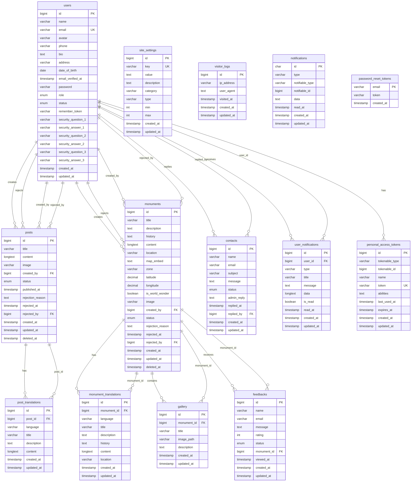

# Database Schema Diagram - Global Heritage CMS

## Database Schema Overview

### Core Tables

#### 1. **users** - User Management
- Stores admin and moderator accounts
- Includes security questions for password recovery
- Role-based access control (admin/moderator)
- Status tracking (active/inactive)

#### 2. **posts** - Blog Posts
- Main content management for articles
- Approval workflow (draft/pending/approved/rejected)
- Soft deletes for data recovery
- Foreign keys to users for creator and reviewer

#### 3. **monuments** - Heritage Sites
- Core entity for heritage locations
- Geographic data (latitude/longitude)
- World wonder classification
- Approval workflow similar to posts

### Translation Tables

#### 4. **post_translations** - Multilingual Posts
- Supports multiple languages per post
- Separate title, description, and content
- Unique constraint on post_id + language

#### 5. **monument_translations** - Multilingual Monuments
- Multilingual support for monuments
- Includes location translations
- Unique constraint on monument_id + language

### Content Management

#### 6. **gallery** - Image Gallery
- Image management for monuments
- Links to monuments via foreign key
- Supports descriptions for each image

#### 7. **feedbacks** - User Feedback
- Public feedback system
- Rating system (1-5 stars)
- Status tracking (pending/approved/rejected)
- Links to specific monuments

#### 8. **contacts** - Contact Messages
- Contact form submissions
- Admin reply system
- Status tracking (new/read/replied)

### System Tables

#### 9. **site_settings** - Configuration
- Dynamic site configuration
- Key-value storage with metadata
- Categories and validation rules

#### 10. **user_notifications** - Custom Notifications
- Custom notification system
- Read/unread status tracking
- Rich data storage (JSON)

#### 11. **visitor_logs** - Analytics
- Visitor tracking by IP
- User agent logging
- Visit timestamp tracking

### Laravel Framework Tables

#### 12. **notifications** - Laravel Notifications
- Laravel's built-in notification system
- Polymorphic relationship support

#### 13. **personal_access_tokens** - API Authentication
- Sanctum token management
- API authentication tokens

#### 14. **password_reset_tokens** - Password Recovery
- Password reset functionality
- Email-based token system

## Key Features

### 🔐 **Security**
- Role-based access control
- API token authentication
- Password reset system
- Security questions

### 🌍 **Multilingual Support**
- Separate translation tables
- Language-specific content
- Flexible language codes

### 📊 **Content Management**
- Approval workflows
- Soft deletes
- Status tracking
- Rich content support

### 📈 **Analytics**
- Visitor tracking
- Feedback system
- Notification management

### 🔧 **Configuration**
- Dynamic settings
- Admin panel integration
- Flexible metadata storage

